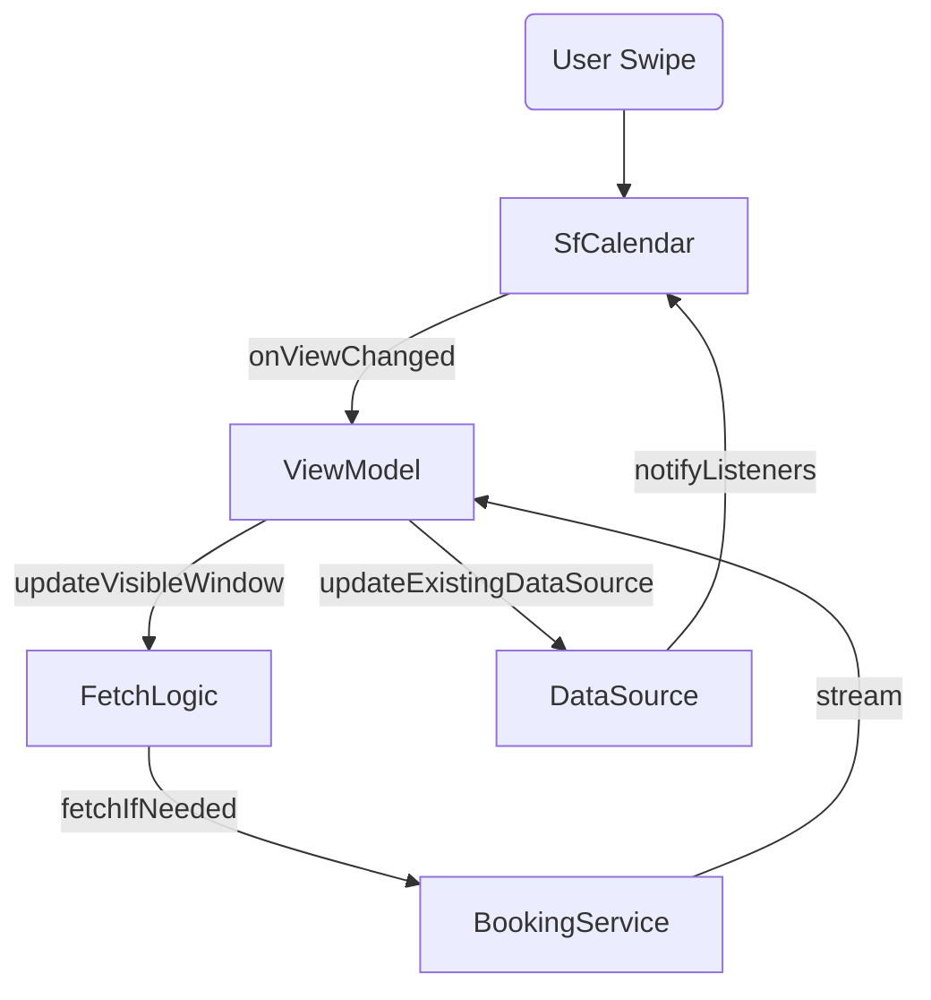

# Design: Calendar Swipe Optimization

## Technical Overview

### 1. Pre-fetching with `onViewChanged`
The `SfCalendar` widget provides an `onViewChanged` callback that returns a `ViewChangedDetails` object containing the `visibleDates`. 
- **Implementation**: We will add this callback to `SfCalendar` in `BookingCalendarView`.
- **Logic**: It will call a new method in `CalendarViewModel`, e.g., `handleViewChanged(List<DateTime> visibleDates)`.
- **Benefit**: This allows us to update the `VisibleWindow` as soon as the user starts interacting with the calendar, triggering the `_fetchWindowController` logic before the animation ends.

### 2. Streamlining the `DataSource`
Currently, `CalendarViewModel` returns a new `_DataSource` object inside every `CalendarViewState`. 
- **Refactoring**: Move the `_DataSource` instance into the `CalendarViewModel` as a long-lived object.
- **Update Mechanism**: When new appointments are fetched, instead of emitting a new state with a new data source, the `CalendarViewModel` will update the existing `_DataSource.appointments` and call `notifyListeners` (if using a custom `CalendarDataSource`) or simply trigger a localized update.
- **Impact**: Syncfusion's `SfCalendar` is optimized to listen to its data source. By keeping the object reference stable, we avoid a full widget rebuild.

### 3. Decoupling View State
The `CalendarViewState` currently bundles `dataSource`, `specialRegions`, `currentView`, and `currentDate`. 
- **Refactoring**: 
    - The `SfCalendar` should ideally be created once.
    - Properties like `currentView` and `currentDate` which are driven *by* the controller shouldn't necessarily be passed *back* into the widget if the controller is already managing them.
    - We will separate "Data" (appointments, regions) from "Configuration" (view type, drag/drop settings).

### 4. Padded Window Strategy
- **Current**: 30 days padding.
- **Adjustment**: Ensure the padding is handled such that a swipe *always* lands on a day that is already loaded. If the user swiped to the very edge of the 30-day window, a background fetch should trigger for the *next* 30 days without interrupting the current view.

## Architecture Diagram

